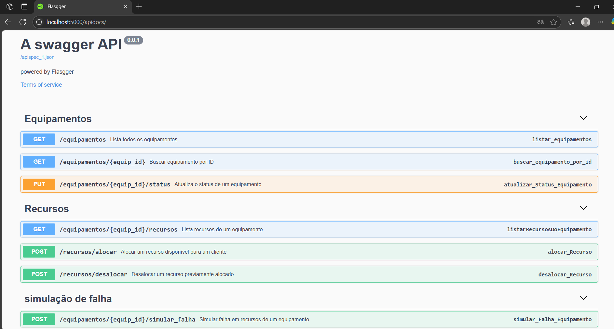
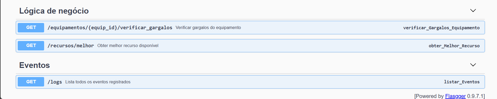

# Desafio CGR - Sistema de Monitoramento de Rede e Alocação de Recursos

## 🧩 Introdução

Este repositório apresenta a solução desenvolvida para o **Desafio de Desenvolvimento Júnior - CGR**, que propõe a criação de um sistema simplificado para **monitoramento de rede e alocação de recursos** em uma empresa de telecomunicações.

O sistema foi projetado para simular um ambiente real onde a empresa gerencia uma ampla infraestrutura de rede. A ferramenta permite:

- Monitorar o status dos equipamentos de rede;
- Alocar e desalocar recursos (como portas de switch e endereços IP);
- Identificar gargalos, falhas e possíveis pontos críticos na infraestrutura.

O foco principal está na **robustez da lógica de negócio**, **integração entre os componentes** e na utilização de **Python, SQL, APIs REST e algoritmos** para fornecer uma solução funcional e bem estruturada.

> **Nota:** A interface gráfica não foi priorizada neste desafio, de acordo com a proposta, permitindo concentrar os esforços na implementação da lógica e arquitetura do sistema.

## 🚀 Como Rodar o Projeto

Este projeto pode ser executado de duas formas:

1. Diretamente com Python (`run.py`);
2. Utilizando Docker Compose para encapsular todos os serviços.

### 🔧 Pré-requisitos

- Python
- Git instalado
- [Opcional] Docker e Docker Compose (para execução em containers)

### 🐍 Método 1: Executando com Python

#### 1. Clone o repositório

```bash
git clone https://github.com/MarcosAndreLS/Desafio_CGR.git
cd Desafio_CGR
```

#### 2. Crie e ative um ambiente virtual

**Windows:**

```bash
python -m venv venv
venv\Scripts\activate
```
**Linux/macOS:**

```bash
python3 -m venv venv
source venv/bin/activate
```

#### 3. Instale as dependências

```bash
pip install -r requirements.txt
```

#### 4. Execute o projeto

```bash
python run.py
```

**A aplicação será iniciada localmente e estará acessível em http://localhost:5000**

### 🐳 Método 2: Executando com docker-compose

#### 1. Clone o repositório

```bash
git clone https://github.com/MarcosAndreLS/Desafio_CGR.git
cd Desafio_CGR
```

#### 2.  Execute o projeto

```bash
docker-compose up --build
```

**A aplicação será exposta na porta definida no docker-compose.yml (por padrão, 5000).**

## 🏗️ Arquitetura Geral

O sistema foi projetado seguindo os princípios de **separação de responsabilidades**, com uma arquitetura em camadas que facilita a manutenção, testes e escalabilidade.

### 🔸 Camadas do Sistema

```bash
[ API (Flask Routes) ]
        │
        ▼
[ Services (Concentra o processamento dos dados) ]
        │
        ▼
[ Repositories (Acesso a Dados - SQL) ]
        │
        ▼
[ Models (Conexão com o Banco de Dados SQLite) ]
```

### Estrutura de Diretórios


```bash
DesafioCGR/
├── app/
│   ├── models/            # Conexão com o banco de dados (ex: db.py)
│   ├── repositories/      # Consultas SQL puras e acesso aos dados
│   ├── routes/            # Endpoints da API (Flask)
│   ├── services/          # Concentra o processamento dos dados
│   └── utils/             # Funções utilitárias (ex: notificar eventos)
│
├── database/              # Scripts SQL para criação e povoamento do banco
│   ├── schema.sql
│   ├── data.sql
│   └── db.sqlite3
│
├── docs/
│   └── equipamentos/      # Documentação Swagger para cada grupo de rotas
│   └── recursos/
│   └── eventos/
│   └── logica_negocio/
│   └── simulacao_falha/
│
├── test/                  # Testes unitários
│   ├── test_equipamento.py
│   └── test_logica_negocio.py
│
├── docker-compose.yml     # Orquestração de serviços com Docker
├── Dockerfile             # Imagem da aplicação
├── run.py                 # Ponto de entrada da aplicação Flask
├── requirements.txt       # Dependências do projeto
├── .gitignore
└── README.md
```

## Como Testar a API com Swagger

A aplicação utiliza o Flasgger para fornecer uma interface Swagger interativa, todos os endpoints da API podem ser testados diretamente pelo navegador.

### Acessando a Interface Swagger

Após iniciar o projeto localmente (com python run.py ou docker-compose up), acesse no seu navegador:

```bash
    http://localhost:5000/apidocs
```




- Todos os endpoints estarão listados por grupo.
- É possível enviar requisições diretamente da interface.
- Os parâmetros esperados e descrições estarão disponíveis.

## 🧠 Lógica de Negócio e Algoritmos

A lógica de negócio do sistema foi desenhada para oferecer **inteligência na alocação de recursos** e **monitoramento ativo de possíveis gargalos e falhas** em equipamentos de rede. Abaixo estão as principais decisões de design adotadas:

### 🔄 Alocação Inteligente de Recursos

A função `obter_melhor_recurso` seleciona o melhor recurso disponível com base em critérios de priorização definidos pela aplicação. Atualmente, o critério adotado é:

- Selecionar o recurso com **status 'Disponível'** que está há mais tempo nessa condição (`status_atualizado_em`), de forma a evitar alocações injustas ou repetitivas.

A rota associada é:

```http
GET /recursos/melhor?tipo_recurso=Porta Ethernet&equipamento_id=1
```

### 🚨 Verificação de Gargalos e Falhas

A função `verificar_gargalos` verifica se um determinado equipamento está enfrentando problemas com base em eventos recentes de falha. Critério utilizado:

- Se houver 3 ou mais eventos "Offline" ou "Com problema" ou "Indisponível" nos últimos 10 minutos, o sistema considera o equipamento com problema.

A rota associada é:

```http
GET /equipamentos/<equipamento_id>/verificar_gargalos
```

## 💥 Simulação de Falhas e Detecção de Problemas

Para testar a resiliência do sistema e a detecção de gargalos, foi implementado um mecanismo de **simulação de falhas controlada**, capaz de alterar o estado dos recursos de um equipamento aleatoriamente.

### ⚙️ Como Funciona a Simulação de Falha

Ao chamar o endpoint de simulação:

```http
POST /equipamentos/<equipamento_id>/simular_falha
```

### O sistema executa as seguintes ações:

#### 1  Recupera todos os recursos associados ao equipamento especificado.

#### 2  Seleciona aleatoriamente uma quantidade de recursos (de 1 até o total existente).

#### 3  Para cada recurso selecionado:

#### 4  Altera seu status para "Com Problema" ou "Indisponível".

#### 5  Preserva o cliente associado (se houver).

#### 6  Registra um evento de falha simulada no sistema.

#### 7  Retorna um resumo dos recursos afetados pela simulação.

### Exemplo de resposta: 

```bash
{
  "dados": {
    "equipamento_id": 3,
    "recursos_afetados": [
      {
        "cliente_preservado": null,
        "recurso_id": 12,
        "status_simulado": "Indisponível"
      },
      {
        "cliente_preservado": "Cliente A",
        "recurso_id": 11,
        "status_simulado": "Com Problema"
      },
      {
        "cliente_preservado": null,
        "recurso_id": 13,
        "status_simulado": "Com Problema"
      },
      {
        "cliente_preservado": "Cliente B",
        "recurso_id": 14,
        "status_simulado": "Com Problema"
      }
    ]
  },
  "mensagem": "Simulação de falha concluída com sucesso."
```

### Como o Sistema Reage às Falhas Simuladas

Após a simulação, os recursos afetados entram em estado indisponível para alocação. Isso impacta diretamente as seguintes funcionalidades:

#### 1. Alocação Inteligente (/recursos/melhor)

- A função obter_melhor_recurso ignora recursos que estão com status "Com Problema" ou "Indisponível".

- Assim, mesmo que existam muitos recursos cadastrados, apenas os disponíveis e válidos são considerados para alocação.

#### 2. Verificação de Gargalos (/equipamentos/<id>/verificar_gargalos)

- A função verificar_gargalos analisa a frequência de eventos "Offline" ou falhas simuladas.

- Se o número ultrapassar um limite (ex: 3 falhas em 10 minutos), o sistema sinaliza o equipamento como problemático.

#### 3. Logs

- Cada falha simulada gera um evento registrado no sistema.

- Isso garante rastreabilidade, permitindo que seja visto quando, onde e o que falhou.

## Próximos Passos para Evoluir o Protótipo

Para transformar este protótipo em um sistema robusto e pronto para produção, os seguintes passos são recomendados:

### 1. Validação e Segurança

- Adicionar autenticação e autorização (ex: JWT)

### 2. Cobertura de Testes

- Ampliar os testes unitários cobrindo todos os serviços e repositórios.
- Incluir testes de performance e carga para pontos críticos.

### 3. Persistência e Escalabilidade

- Migrar de SQLite para um banco mais robusto (ex: PostgreSQL ou MySQL).

### 4. Observabilidade e Logs

- Implementar monitoramento com Prometheus + Grafana.

### 5. Melhorias de Lógica

- Agendar verificações periódicas e ações automáticas em caso de falhas.

## Considerações Finais

Ainda há bastante espaço para evoluir, mas já dá pra ter uma noção clara do funcionamento do sistema. Fico à disposição para qualquer dúvida ou sugestão, e agradeço desde já pela atenção na avaliação! Independente do resultado, já fico extremamente contento só pelo a aportunidade de ter participado desse desafio seletivo.
